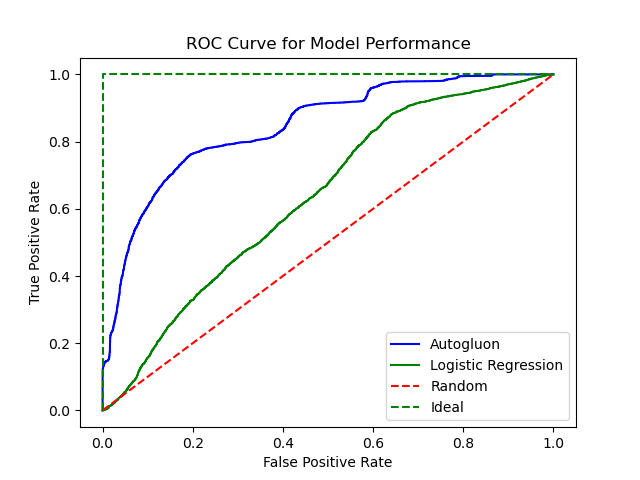

## Project Motivation

Starbucks partnered with Udacity to provide simulated data reflecting a real-world business problem in analyzing customer behavior. This data focuses on tailoring personalized promotional offers to customers that are most likely to use them. We want to determine what kind of offer, if any, to send to customers in the Rewards Program, such that they are likely to drive engagement and sales.

## Data

All data belongs to Udacity and Starbucks. It consist of the following files:

- profile.json: Rewards program users (17000 users x 5 fields)

  - gender: (categorical) M, F, O, or null
  - age: (numeric) missing value encoded as 118
  - id: (string/hash)
  - became_member_on: (date) format YYYYMMDD
  - income: (numeric)

- portfolio.json: Offers sent during 30-day test period (10 offers x 6 fields)

  - reward: (numeric) money awarded for the amount spent
  - channels: (list) web, email, mobile, social
  - difficulty: (numeric) money required to be spent to receive reward
  - duration: (numeric) time for offer to be open, in days
  - offer_type: (string) bogo, discount, informational
  - id: (string/hash)

- transcript.json: Event log (306648 events x 4 fields)

  - person: (string/hash)
  - event: (string) offer received, offer viewed, transaction, offer completed
  - value: (dictionary) different values depending on event type
  - offer id: (string/hash) not associated with any “transaction”
  - amount: (numeric) money spent in “transaction”
  - reward: (numeric) money gained from “offer completed”
  - time: (numeric) hours after start of test

## Files

`base_analysis.ipynb`: Includes all the major code for this project, going from data loading + preprocessing to model development and testing
`img/`: Includes all images used in the report
`requirements.txt`: Documents the key required libraries for this project

## Key libraries used

- sagemaker: AWS SageMaker Python SDK. For interacting with SageMaker and S3, and eventually deploying trained model to an API endpoint
- scikit-learn: Defines several model classes and relevant metrics
- autogluon: Auto-ML library with model selection and ensembling innately built into the pipeline
- pandas: data manipulation and cleaning

## Results

 

| Model | F1 | Accuracy | Precision | Recall |  
| ----------- | ----------- | ----------- | ----------- | ----------- |  
| Logistic Regression | 0.71 | 0.63 | 0.64 | 0.8 |
| Autogluon   | 0.78 | 0.71 | 0.67 | 0.92 |

The Autogluon model consistently outperforms Logistic Regression on this dataset.