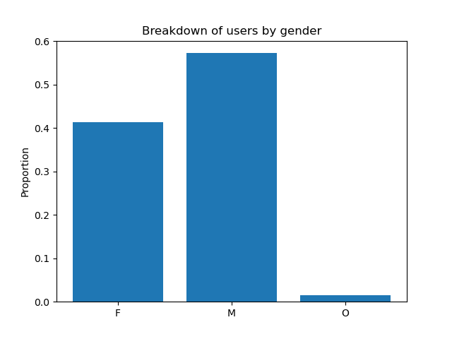
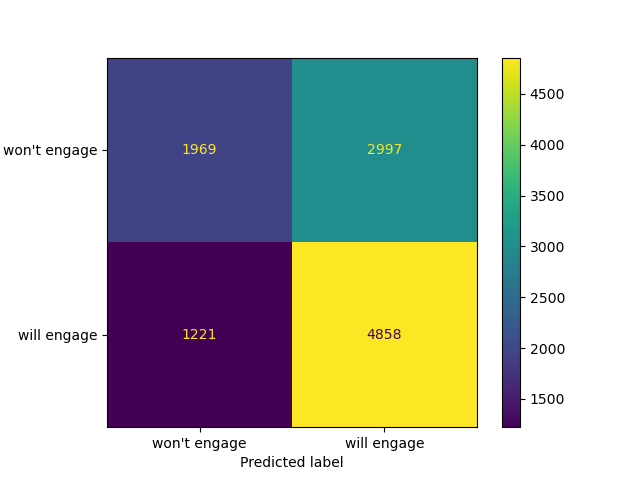
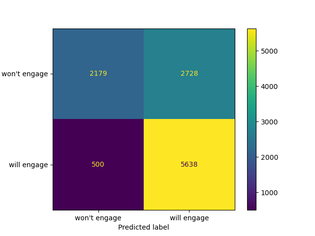

# Starbucks Customer Rewards

## Background

This project is part of the AWS Machine Learning Engineer Nanodegree with Udacity. Udacity partnered with Starbucks to provide simulated data on customer behavior.

Starbucks, the American coffeeshop chain, periodically sends promotional offers to users via channels such as a mobile app or email. As part of an incentives and marketing strategy, we want to better understand how customers are responding to these offers, and how we can determine the best offer to provide.

Providing better offers to customers can help to build brand loyalty, maximize engagement, and increase net revenue.

## Problem Statement

How can we leverage experimental data to enchance the rewards program at Starbucks?
We want to better understand what offers to provide individual users based on their purchasing habits.

## Datasets and Inputs

As provided by Udacity:

- The program used to create the data simulates how people make purchasing decisions and how those decisions are influenced by promotional offers.
- Each person in the simulation has some hidden traits that influence their purchasing patterns and are associated with their observable traits. People produce various events, including receiving offers, opening offers, and making purchases.
- As a simplification, there are no explicit products to track. Only the amounts of each transaction or offer are recorded.
- There are three types of offers that can be sent: buy-one-get-one (BOGO), discount, and informational. In a BOGO offer, a user needs to spend a certain amount to get a reward equal to that threshold amount. In a discount, a user gains a reward equal to a fraction of the amount spent. In an informational offer, there is no reward, but neither is there a requisite amount that the user is expected to spend. Offers can be delivered via multiple channels.
- The basic task is to use the data to identify which groups of people are most responsive to each type of offer, and how best to present each type of offer.

The data is divided into 3 sections, collected over a 30-day period:

- profile.json: Rewards program users (17000 users x 5 fields)

  - gender: (categorical) M, F, O, or null
  - age: (numeric) missing value encoded as 118
  - id: (string/hash)
  - became_member_on: (date) format YYYYMMDD
  - income: (numeric)

- portfolio.json: Offers sent during 30-day test period (10 offers x 6 fields)

  - reward: (numeric) money awarded for the amount spent
  - channels: (list) web, email, mobile, social
  - difficulty: (numeric) money required to be spent to receive reward
  - duration: (numeric) time for offer to be open, in days
  - offer_type: (string) bogo, discount, informational
  - id: (string/hash)

- transcript.json: Event log (306648 events x 4 fields)

  - person: (string/hash)
  - event: (string) offer received, offer viewed, transaction, offer completed
  - value: (dictionary) different values depending on event type
  - offer id: (string/hash) not associated with any “transaction”
  - amount: (numeric) money spent in “transaction”
  - reward: (numeric) money gained from “offer completed”
  - time: (numeric) hours after start of test

## Data Preparation

### User data

remove null entries

- gender, income, and age

Concerns around sample bias if we filter users without incomes. However every user who didn't fill this in also didn't fill in gender. An alternative might be a pessimistic imputation (fill in the values with the lowest income value)

### Transaction data

I can see which users fulfilled promotional offers, and which did not. Using this, I can define propensity, which is # fulfilled / # viewed.

### Offer data

Converting distribution into binary flags

### Feature engineering

Partially covered above.

One-hot encoding categorical features

- gender for user data
- offer type in offer data

Similarly, creating binary flags for offer channels

### Joining everyting together

bring everything together into a tabular dataset that can be fed into a machine learning model.

Join propensity data with user and offer datasets, linking them through the corresponding ids ("person" for the former, "offer id" for the latter)

Save this to a csv for future reference, so as to minimize the future work if I want to revisit this.

Classification model requires binary inputs, so for simplicity I will round the in-between entries. Given that these are a small minority of the data, it should not significantly impact performance.

## Preliminary analysis

Transaction and offer completion data:

  
  

(for informational offers, there is no completion event, so the rate is trivially 0)

user data:

  

## Model

Including offer details as an input feature allows us to simulate the reception to new offer programs. Also, it helps to better understand what types of offers are the most effective

### Evaluation Metric

F1 score:

$$F1 = \frac{2 * precision * recall}{precision * recall}$$

This provides a good balance between two often-conflicting metrics: precision and recall

For reference, precision is the likelihood that an input predicted to be positive is actually positive. Recall is the probability that a positive instance will be labeled as such.  

In other words, when we do find combinations that are promising, can we be confident in our estimate? And will we be able to reach every possible opportunity?

### Benchmark: Logistic Regression Model

SKLearn's Logistic Regression module was used as a baseline due to its simplicity and ease of training and evaluation.

  

### Autogluon

Autogluon provides innate model selection and ensembling to provide overall strong performance

  

Confusion matrix above shows performance for AG model. Half as many false negatives in comparison to the baseline model.

  
  
  
| Model | F1 | Accuracy | Precision | Recall |  
| ----------- | ----------- | ----------- | ----------- | ----------- |  
| Logistic Regression | X | | | |
| Autogluon   | X | | | |

(Feature importance?)

## Conclusion

In this project, I have analyzed and cleaned data related to rewards programs and user transactions. I have also used that data to prepare a model that can predict the likelihood of a user engaging with a promotional offer and making a transaction as a result.  The ensemble model generated by Autogluon provides an F1-score of 0.78. Given that it produces half as many false negatives as the baseline model, this is a net win! :D

### Future considerations

- dig further into hyperparameter tuning; possible improvements to be made
- incorporate other data sources into predictions:
  - macroeconomic data; How do market conditions influence customer patterns?
- Test the model on new offer programs
- focus further on user transaction behavior: can we determine if a transaction would have occurred without the offer? If so, can we only target users who would initiate new transactions?
