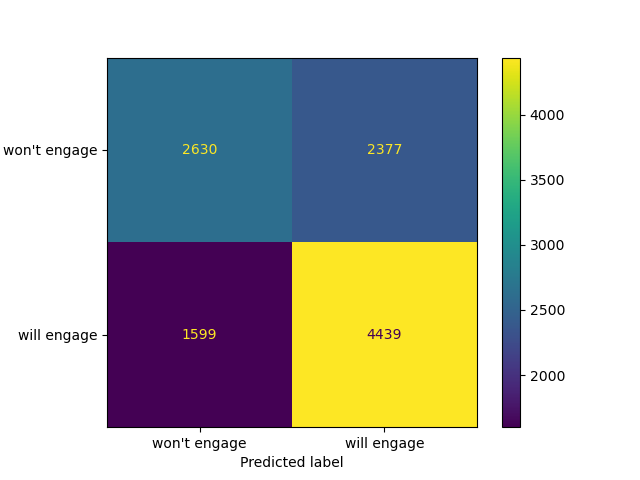

# Starbucks Customer Rewards

## Background

This project is part of the AWS Machine Learning Engineer Nanodegree with Udacity. Udacity partnered with Starbucks to provide simulated data on customer behavior.

Starbucks, the American coffeeshop chain, periodically sends promotional offers to users via channels such as a mobile app or email. As part of an incentives and marketing strategy, we want to better understand how customers are responding to these offers, and how we can determine the best offer to provide.

Providing better offers to customers can help to build brand loyalty, maximize engagement, and increase net revenue.

## Problem Statement

How can we leverage experimental data to enchance the rewards program at Starbucks?
We want to better understand what offers to provide individual users based on their purchasing habits.

## Datasets and Inputs

As provided by Udacity:

- The program used to create the data simulates how people make purchasing decisions and how those decisions are influenced by promotional offers.
- Each person in the simulation has some hidden traits that influence their purchasing patterns and are associated with their observable traits. People produce various events, including receiving offers, opening offers, and making purchases.
- As a simplification, there are no explicit products to track. Only the amounts of each transaction or offer are recorded.
- There are three types of offers that can be sent: buy-one-get-one (BOGO), discount, and informational. In a BOGO offer, a user needs to spend a certain amount to get a reward equal to that threshold amount. In a discount, a user gains a reward equal to a fraction of the amount spent. In an informational offer, there is no reward, but neither is there a requisite amount that the user is expected to spend. Offers can be delivered via multiple channels.
- The basic task is to use the data to identify which groups of people are most responsive to each type of offer, and how best to present each type of offer.

The data is divided into 3 sections, collected over a 30-day period:

- profile.json: Rewards program users (17000 users x 5 fields)

  - gender: (categorical) M, F, O, or null
  - age: (numeric) missing value encoded as 118
  - id: (string/hash)
  - became_member_on: (date) format YYYYMMDD
  - income: (numeric)

- portfolio.json: Offers sent during 30-day test period (10 offers x 6 fields)

  - reward: (numeric) money awarded for the amount spent
  - channels: (list) web, email, mobile, social
  - difficulty: (numeric) money required to be spent to receive reward
  - duration: (numeric) time for offer to be open, in days
  - offer_type: (string) bogo, discount, informational
  - id: (string/hash)

- transcript.json: Event log (306648 events x 4 fields)

  - person: (string/hash)
  - event: (string) offer received, offer viewed, transaction, offer completed
  - value: (dictionary) different values depending on event type
  - offer id: (string/hash) not associated with any “transaction”
  - amount: (numeric) money spent in “transaction”
  - reward: (numeric) money gained from “offer completed”
  - time: (numeric) hours after start of test

## Data Preparation

```
df_users = pd.read_json('data/profile.json', lines=True)
df_portfolio = pd.read_json('data/portfolio.json', lines=True)
df_transcript = pd.read_json('data/transcript.json', lines=True)
```

Load the provided datasets into Pandas DataFrames so that they can be processed and analyzed in a Jupyter notebook.

### User data

```
df_users['became_member_on'] = pd.to_datetime(df_users['became_member_on'], format='%Y%m%d')
df_users.isnull().sum()
df_users.dropna(subset='gender', inplace=True)
df_users = df_users[df_users['age'] != 118]
```

The above code chunk removes null entries in the user data. In particular rows with null values for gender, income, or age (which gets recorded as 118 for some reason).  It also parses out the timestamp into a Python datetime object.

If sample bias is a concern when removing incomplete data, then an alternative might be to use pessimistic imputation instead (for instance: fill in the income with the lowest reported income in the data).

The following code chunk converts the user's signup date into 3 distinct features, each of which can be represented numerically. It is possible that there are seasonal patterns in the data, which temporal features such as these could capture.

```
df_users['month_signup'] = df_users['became_member_on'].dt.month
df_users['year_signup'] = df_users['became_member_on'].dt.year
df_users['day_signup'] = df_users['became_member_on'].dt.day
```


### Transaction data

I can see which users fulfilled promotional offers, and which did not.  
Using this, I can define a propensity score for each user/offer set. 
This can be computed as the ratio of the completed offers to the number of viewed offers.

```
df_transcript['is_transaction'] = df_transcript['event'] == 'transaction'
df_transcript['is_completed'] = df_transcript['event'] == 'offer completed'
df_transcript['is_viewed'] = df_transcript['event'] == 'offer viewed'
df_transcript['is_received'] = df_transcript['event'] == 'offer received'
user_agg = df_transcript.groupby(['person', 'offer_id'])[['is_received', 'is_viewed', 'is_completed', 'is_transaction']].sum()
user_agg['propensity'] = user_agg['is_completed'] / user_agg['is_viewed']
```

One edge case to consider is when a user completes an offer without viewing it. This should not be considered as influenced behavior, as the user had no knowledge of the offer during their transactions. While beyond the scope of this project, one consideration may be to adjust the promotions such that users have to view them or somehow opt-in in order to be eligible.


### Offer data

The main processing to be done on this data is to parse out the channel data from a series of lists. Because there are only 4 distinct channels, we can simply create a binary flag for each one:
```
channels = set(df_portfolio['channels'].sum())
for channel in channels:
    df_portfolio[f'is_{channel}'] = df_portfolio['channels'].apply(lambda x: channel in x)
```

### Feature engineering

This is partially addressed above, but one last step in the preprocessing is in handling categorical data:

```
pd.get_dummies(final_df)
```

The above chunk generates one-hot encodings for categorical features. In particular this applies to the 'gender' column in user data and the 'offer type' in the offer portfolio data.

### Joining everyting together

Now that we've cleaned and processed the original datasets, we can combine everything into a single tabular dataset that can subsequently be fed into a machine learning model.

```
final_df = pd.merge(
    target_value,
    pd.merge(df_users, df_portfolio, on='key', how='inner'),
    on=['person', 'offer_id'], how='inner'
)
```

The above code combines the datasets using a table join, linking everything through the corresponding id's for each table ('person' for the user data, and 'offer_id' for the offer portfolio data).

```final_df['propensity'] = final_df['propensity'].round(0)```

Classification model requires binary inputs, so for simplicity I will round the in-between entries. Given that these are a small minority of the data, it should not significantly impact performance.

## Preliminary analysis

Transaction and offer completion data:

  

View rate is defined as the proportion of received offers that are then viewed by the user. BOGO-based offers have the highest view rate, approximately 80% while the other offers are closer to 70%.

  

Completion rate is defined as the proportion of received offers that are then completed by the user. Completion consists of performing a transaction that meets the offer's minimum spend and is done before the offer's expiration date.

Counter to above, the completion rate is higher for discount-based offers than it is for BOGO-based offers.

(for informational offers, there is no completion event, so the rate is trivially 0)

  

The above graph shows the distribution of users by gender. The main takeaway here is that a slight majority (60%) are male, and a very small minority are classified as "other".

  

Similarly, the above graph shows the distribution of incomes for reward users. The main takeaway is that this distribution is slightly skewed right, which is to be expected with income values. A log transform might be considered, but for the models we're considering, this won't be necessary.

## Model

The modeling approach will be to predict whether or not a user will engage with a given offer. This can be presented as a classification problem, where the inputs are the user and the offer, and the output is the transaction likelihood.

Including offer details as an input feature allows us to simulate the reception to new offer programs. Also, it helps to better understand what goes into effective offers.

This type of model would provide value in prioritizing users to target with future campaigns.  For campaigns that are more resource-intensive, this can help to reduce the scope, so that we focus it towards the most promising users.
Also, it would allow for testing new campaigns against the existing user base. When considering multiple promotional offers, an quick approach would be to pick the offer that yields the most positive predictions against the existing user base.

The model can be trained in AWS SageMaker. Data can be stored in AWS S3 and prepared in a SageMaker Notebook instance with a Jupyter Notebook. Once a model is trained, it can be saved locally and loaded as needed for offline predictions. With the current data volume, predictions can be done offline and locally, without the need to use model or data parallelization.

### Train/Test Split

Before any model testing is done, the data needs to be split into a train set and a test set. The former will be used to build a model, and the latter will be used to evaluate the final performance. This is necessary because we want to estimate the model's performance on unseen data, so as to understand how it will perform in a production setting.

For this case, I specified the test set to be 20% of the full dataset.

Optionally, the training data can be further split into a validation set for hyperparameter tuning. Autogluon handles validation sets innately, so a separate validation set is not necessary.

```
from sklearn.model_selection import train_test_split
train_data, test_data = train_test_split(final_df, test_size=0.2)
```

### Evaluation Metric

F1 score:

$$F1 = \frac{2 * precision * recall}{precision * recall}$$

This provides a good balance between two often-conflicting metrics: precision and recall

For reference, precision is the likelihood that an input predicted to be positive is actually positive. Recall is the probability that a positive instance will be labeled as such.  

In other words, when we do find combinations that are promising, can we be confident in our estimate? And will we be able to reach every possible opportunity?

### Benchmark: Logistic Regression Model

SKLearn's Logistic Regression module was used as a baseline due to its simplicity and ease of training and evaluation.

  

The above confusion matrix compares the true labels against the predicted labels.
In other words, how often do we misclassify user/offer combos? And how do we misclassify them?
Ideally we land in the top left or bottom right buckets, which correspond to correct predictions.

This model is evenly split between true negatives and false positives, suggesting that it is biased towards positive predictions (~8000 positive predictions vs ~2600 negative).  In this context, we prefer false positives to false negatives, so this is not a major concern.
False negatives correspond to a missed opportunity (we fail to identify a user/offer combo that would lead to engagement) while false positives correspond to wasted resources (sending a user an offer that they won't use).

### Autogluon

Autogluon provides innate model selection and ensembling to provide overall strong performance. The final model ended up being an ensemble of simpler classification models including Gradient Boosted Decision Trees, Random Forests, and KNN Classifiers.

  

The confusion matrix above shows performance for AG model. While it is still biased towards positive predictions, it yields as many false negatives in comparison to the baseline model. Given that we want to minimize false negatives in this context, this is a significant improvement.

  

The above ROC curve describes the performance of the model as we adjust the cutoff threshold for positive/negative predictions. An ideal model would be as close as possible to the upper left-hand corner of this plot. The AG model is consistently above the Logistic Regression model here, suggesting that it consistently outperforms the baseline.

| Model | F1 | Accuracy | Precision | Recall |  
| ----------- | ----------- | ----------- | ----------- | ----------- |  
| Logistic Regression | 0.71 | 0.63 | 0.64 | 0.8 |
| Autogluon   | 0.78 | 0.71 | 0.67 | 0.92 |

Finally, the above table documents several key performance metrics between the two models. The AG model consistently outpeforms the Logistic Regression baseline on every metric.

Since Autogluon saves trained models automatically, the notebook can be shut off, and predictions can be done offline or in a SageMaker notebook using the following code chunk:
```
predictor = TabularPredictor.load("AutogluonModels/ag-20230220_072003/")
input_data = test_data.sample(1)
predictor.predict(input_data.drop('propensity', axis=1))
```

## Conclusion

In this project, I have analyzed and cleaned data related to rewards programs and user transactions. I have also used that data to prepare a model that can predict the likelihood of a user engaging with a promotional offer and making a transaction as a result.  The ensemble model generated by Autogluon provides an F1-score of 0.78. Given that it produces half as many false negatives as the baseline model, this is a net win! :D

### Future considerations

1. I can spend more time on hyperparameter tuning; possible improvements to be made by adjusting the features of both the baseline and the Autogluon model. For instance: If I extend the max training time, will performance improve?
2. Incorporate other data sources into predictions:
  - For instance: macroeconomic data; How do market conditions influence customer patterns?
3. Consider potential new offer programs on which to test the model. What offers will yield the highest likelihood of engagement?
4. Focus further on user transaction behavior.
  - Can we determine if a transaction would have occurred without the offer? If so, can we only target users who would initiate new transactions?
5. Deploy to an endpoint
  - the current use case and data volume is small enough that predictions can be done offline. But if we need to utilize more cloud resources, then we can set up an AWS endpoint for the model. Documentation for doing that with Autogluon can be found here: https://github.com/aws/amazon-sagemaker-examples/tree/main/advanced_functionality/autogluon-tabular-containers
